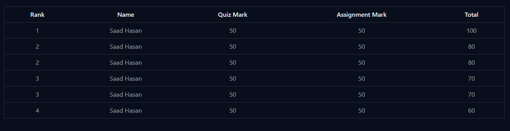

```javascript
const assignmentMark = [
  {
    id: 1,
    student_id: 2,
    student_name: "Saad Hasan",
    assignment_id: 1,
    title: "Assignment 1 - Implement Debounce Function",
    createdAt: "2021-01-15T15:17:01.727Z",
    totalMark: 100,
    mark: 0,
    repo_link: "https://github.com/Learn-with-Sumit/assignment-1",
    status: "pending",
  },
  {
    id: 2,
    student_id: 2,
    student_name: "Saad Hasan",
    assignment_id: 1,
    title: "Assignment 2 - Implement Best Practices",
    createdAt: "2021-01-15T15:17:01.727Z",
    totalMark: 100,
    mark: 100,
    repo_link: "https://github.com/Learn-with-Sumit/assignment-1",
    status: "published",
  },
  {
    id: 3,
    student_id: 8,
    student_name: "Akash Ahmed",
    assignment_id: 1,
    title: "Assignment 2 - Implement Best Practices",
    createdAt: "2021-01-15T15:17:01.727Z",
    totalMark: 100,
    mark: 50,
    repo_link: "https://github.com/Learn-with-Sumit/assignment-1",
    status: "published",
  },
];

const quizMark = [
  {
    id: 1,
    student_id: 2,
    student_name: "Saad Hasan",
    video_id: 1,
    video_title:
      "Debounce Function in JavaScript - JavaScript Job Interview question",
    totalQuiz: 2,
    totalCorrect: 1,
    totalWrong: 1,
    totalMark: 10,
    mark: 5,
  },
  {
    id: 2,
    student_id: 8,
    student_name: "Saad Hasan",
    video_id: 1,
    video_title:
      "Debounce Function in JavaScript - JavaScript Job Interview question",
    totalQuiz: 2,
    totalCorrect: 1,
    totalWrong: 1,
    totalMark: 10,
    mark: 10,
  },
];
```

<p align="center">
  
</p>

এখানে দুইটা Array আছে , একটা হল Assignment Mark Array আরেকটা হল Quiz Mrak Array |
এখানে দুইটা Array থেকে নাম্বারগুলো যোগ করে রেঙ্ক বের করতে হবে, যদি দুইটা ইউজারের নাম্বার সেম হয় তাহলে তাদের সিরিয়াল একই থাকবে |

====================================================

আমি যেটা ভাবতেছি, এখানে দুইটা Array কে Student_id দিয়ে Sort করে একটা নতুন Array of Object তৈরি করা ।

যেমন

```javascript
[
  {
    id: 1,
    student_id: 2,
    student_name: "Saad Hasan",
    assignmentMark: 50,
    quizMark: 50,
    totalMrk: 100,
  },
  {
    id: 2,
    student_id: 4,
    student_name: "Mahadi Hasan",
    assignmentMark: 50,
    quizMark: 50,
    totalMrk: 100,
  },
];
```

তারপর নতুনে Array থেকে Rank বের করা |

=================================================

এখন এখানে দুইটা Array থেকে কিভাবে সিঙ্গেল এরে তৈরি করব বুঝতে পারতেছিনা |

=================================================

কিভাবে করা যায় কাজটা যদি কিছু আইডিয়া দিতেন
